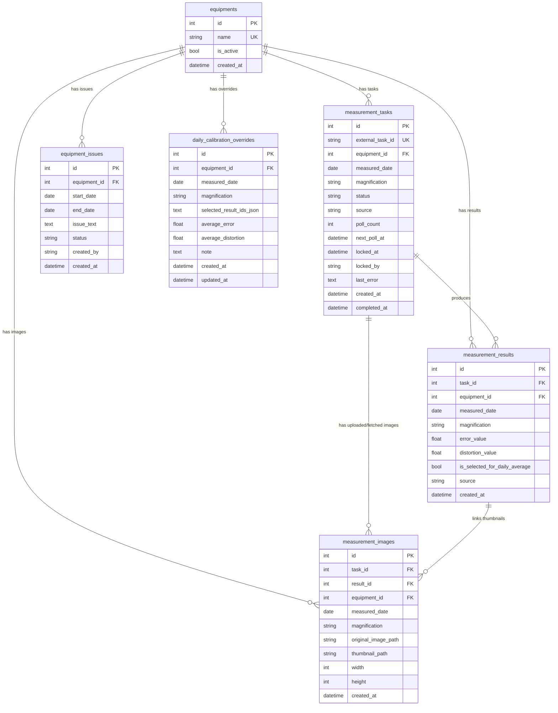
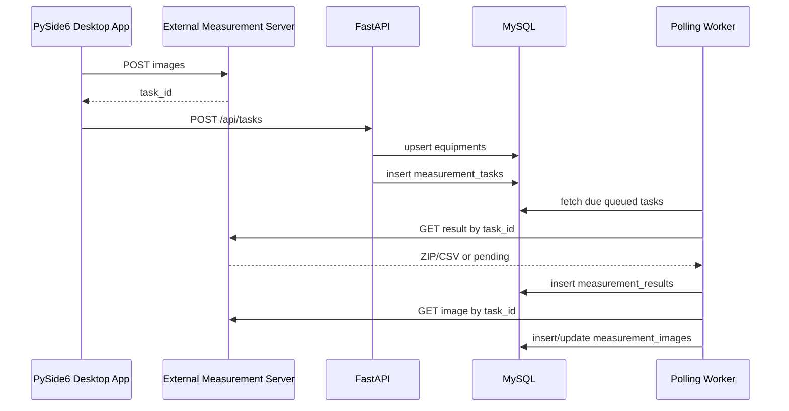
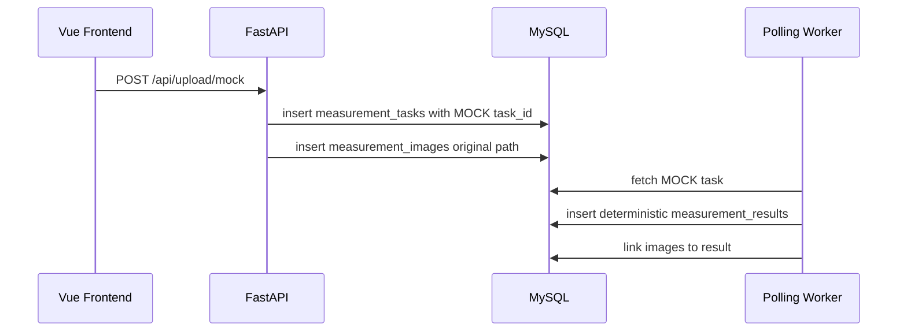

# SCALE DB Structure

이 문서는 현재 SQLAlchemy 모델 기준의 데이터베이스 구조를 정리한 것입니다.

## 전체 개요

SCALE의 DB는 크게 6개 테이블로 구성됩니다.

```text
equipments                  설비 마스터
measurement_tasks           측정 서버 task_id 기반 작업 큐
measurement_results         측정 완료 결과값
measurement_images          원본 이미지와 썸네일 경로
equipment_issues            설비 이슈/점검 상태 기간 등록
daily_calibration_overrides 이미지 리뷰에서 선택한 결과 평균값
```

## 기존 DB 구조와 새 구조 매핑

기존 시스템의 테이블 구조는 아래와 같이 새 구조로 정리됩니다.

| 기존 테이블 | 기존 역할 | 새 테이블 | 변경 이유 |
| --- | --- | --- | --- |
| `facility` | 설비 마스터 | `equipments` | 설비명 외에도 활성 여부, 생성일 등 관리 가능 |
| `calib_queue` | task_id polling queue | `measurement_tasks` | queue 상태, 재시도, lock, 오류 기록을 함께 관리 |
| `log` | 고배율 H 결과 | `measurement_results` | H/M 결과를 하나의 테이블에 저장하고 `magnification`으로 구분 |
| `log2` | 중배율 M 결과 | `measurement_results` | 결과 조회/평균/리뷰 로직을 단순화 |
| 없음 | 이미지/썸네일 관리 | `measurement_images` | 원본 이미지와 256x256 썸네일 조회를 위해 추가 |
| 없음 | 설비 이슈 기간 관리 | `equipment_issues` | 고장/점검/촬영 이슈를 대시보드에 표시하기 위해 추가 |
| 없음 | 이미지 선택 평균값 | `daily_calibration_overrides` | 잘못 촬영된 이미지 제외 후 일자 평균을 재정의하기 위해 추가 |

기존 Desktop Application이 보내던 payload는 새 API에서도 받을 수 있도록 호환됩니다.

```json
{
  "Facility": "EQP-01",
  "task_id": "external-task-id",
  "date": "2026-07-22",
  "Magtype": "H"
}
```

내부 저장 시 `Magtype` 값은 아래처럼 정규화됩니다.

```text
H      -> HIGH
M      -> MIDDLE
HIGH   -> HIGH
MIDDLE -> MIDDLE
```

기존 `log`/`log2`처럼 배율별로 테이블을 나누지 않고, 새 구조에서는 한 테이블에 저장합니다.

```text
measurement_results.magnification = "HIGH"   기존 log
measurement_results.magnification = "MIDDLE" 기존 log2
```

## ERD



## 테이블별 역할

## 1. equipments

설비 마스터 테이블입니다. 한 번이라도 등록된 설비는 이 테이블에 남고, FrontEnd 오른쪽의 설비 점검 현황 리스트는 이 테이블을 기준으로 표시됩니다.

| Column | Type | Key | Description |
| --- | --- | --- | --- |
| id | Integer | PK | 설비 내부 ID |
| name | String(120) | Unique, Index | 설비명 |
| is_active | Boolean |  | 사용 여부 |
| created_at | DateTime |  | 생성 시각 |

주요 사용처:

```text
GET  /api/equipments
POST /api/equipments
POST /api/tasks
GET  /api/dashboard
```

## 2. measurement_tasks

측정 서버에서 받은 `task_id`를 저장하는 작업 큐 테이블입니다. Desktop App 또는 Web Upload가 작업을 등록하면 이 테이블에 row가 생성되고, worker가 지속적으로 조회합니다.

| Column | Type | Key | Description |
| --- | --- | --- | --- |
| id | Integer | PK | 내부 작업 ID |
| external_task_id | String(160) | Unique, Index | 외부 측정 서버의 task_id |
| equipment_id | Integer | FK, Index | `equipments.id` |
| measured_date | Date | Index | 측정 일자 |
| magnification | String(16) | Index | `HIGH` 또는 `MIDDLE` |
| status | String(24) | Index | `queued`, `polling`, `succeeded`, `failed` |
| source | String(32) |  | `desktop`, `web_upload` 등 |
| poll_count | Integer |  | worker 조회 횟수 |
| next_poll_at | DateTime | Index | 다음 조회 예정 시각 |
| locked_at | DateTime |  | worker lock 시각 |
| locked_by | String(80) |  | lock을 잡은 worker ID |
| last_error | Text |  | 마지막 오류 메시지 |
| created_at | DateTime |  | 생성 시각 |
| completed_at | DateTime |  | 완료 시각 |

주요 사용처:

```text
POST /api/tasks
POST /api/upload/mock
worker/poller.py
GET  /api/dashboard
```

오른쪽 표의 `H Mag.`, `M Mag.` O/X는 현재 `measurement_tasks`의 일자별 등록 개수를 기준으로 판단합니다.

```text
해당 일자 + 설비 + 배율의 task 개수 >= 3 이면 O
그 외에는 X
```

## 3. measurement_results

worker가 측정 서버에서 ZIP/CSV를 받아 성공적으로 파싱한 결과값을 저장합니다. 그래프의 평균값은 이 테이블의 `error_value`를 기준으로 계산됩니다.

| Column | Type | Key | Description |
| --- | --- | --- | --- |
| id | Integer | PK | 결과 ID |
| task_id | Integer | FK, Index | `measurement_tasks.id` |
| equipment_id | Integer | FK, Index | `equipments.id` |
| measured_date | Date | Index | 측정 일자 |
| magnification | String(16) | Index | `HIGH` 또는 `MIDDLE` |
| error_value | Float |  | Calibration error |
| distortion_value | Float |  | Distortion value |
| is_selected_for_daily_average | Boolean |  | 일자 평균 계산 포함 여부 |
| source | String(32) |  | 결과 생성 출처 |
| created_at | DateTime |  | 생성 시각 |

제약 조건:

```text
Unique(task_id, magnification)
```

주요 사용처:

```text
GET  /api/dashboard
GET  /api/images
POST /api/calibration-overrides
worker/poller.py
```

## 4. measurement_images

원본 이미지와 worker가 생성한 256x256 썸네일 경로를 저장합니다. 이미지 리뷰 화면에서 특정 일자/설비/배율의 이미지를 조회할 때 사용합니다.

| Column | Type | Key | Description |
| --- | --- | --- | --- |
| id | Integer | PK | 이미지 ID |
| task_id | Integer | FK, Index | `measurement_tasks.id` |
| result_id | Integer | FK, Nullable, Index | `measurement_results.id` |
| equipment_id | Integer | FK, Index | `equipments.id` |
| measured_date | Date | Index | 측정 일자 |
| magnification | String(16) | Index | `HIGH` 또는 `MIDDLE` |
| original_image_path | String(500) |  | 원본 이미지 상대 경로 |
| thumbnail_path | String(500) |  | 썸네일 상대 경로 |
| width | Integer |  | 원본 이미지 너비 |
| height | Integer |  | 원본 이미지 높이 |
| created_at | DateTime |  | 생성 시각 |

주요 사용처:

```text
POST /api/upload/mock
GET  /api/images
worker/poller.py
```

## 5. equipment_issues

설비 고장, 점검, 이미지 촬영 문제 같은 상태 이슈를 기간 단위로 저장합니다. 오른쪽 설비 점검 현황의 상태 열에 표시됩니다.

| Column | Type | Key | Description |
| --- | --- | --- | --- |
| id | Integer | PK | 이슈 ID |
| equipment_id | Integer | FK, Index | `equipments.id` |
| start_date | Date | Index | 이슈 시작일 |
| end_date | Date | Index | 이슈 종료일 |
| issue_text | Text |  | 이슈 설명 |
| status | String(24) |  | 기본값 `open` |
| created_by | String(80) |  | 등록자 |
| created_at | DateTime |  | 생성 시각 |

주요 사용처:

```text
POST /api/issues
GET  /api/issues
PUT  /api/issues/{issue_id}
GET  /api/dashboard
```

대시보드에서는 아래 조건의 이슈만 현재 상태로 표시합니다.

```text
start_date <= status_date
end_date >= status_date
status == "open"
```

## 6. daily_calibration_overrides

이미지 리뷰 화면에서 특정 일자/설비/배율의 이미지 중 일부를 선택했을 때, 선택된 결과들의 평균값을 저장합니다.

| Column | Type | Key | Description |
| --- | --- | --- | --- |
| id | Integer | PK | override ID |
| equipment_id | Integer | FK, Index | `equipments.id` |
| measured_date | Date | Index | 측정 일자 |
| magnification | String(16) | Index | `HIGH` 또는 `MIDDLE` |
| selected_result_ids_json | Text |  | 선택된 `measurement_results.id` 목록 JSON |
| average_error | Float |  | 선택 결과들의 평균 error |
| average_distortion | Float |  | 선택 결과들의 평균 distortion |
| note | Text |  | 메모 |
| created_at | DateTime |  | 생성 시각 |
| updated_at | DateTime |  | 수정 시각 |

제약 조건:

```text
Unique(equipment_id, measured_date, magnification)
```

주요 사용처:

```text
POST /api/calibration-overrides
```

주의:

현재 대시보드의 2주 그래프는 `measurement_results.is_selected_for_daily_average = true`인 row를 기준으로 평균을 계산합니다. `daily_calibration_overrides`는 저장은 되지만, 현재 `GET /api/dashboard` 그래프 계산에는 아직 직접 반영되지 않습니다.

## 데이터 흐름

## Desktop App 등록 흐름



## Web Upload Mock 흐름



## Dashboard 계산 기준

2주 그래프:

```text
measurement_results
WHERE measured_date BETWEEN start_date AND end_date
  AND is_selected_for_daily_average = true
GROUP BY measured_date, magnification
```

오른쪽 설비 점검 현황:

```text
기준 설비 목록: equipments 전체
H Mag. / M Mag.: measurement_tasks의 status_date 기준 배율별 task 개수
상태: equipment_issues 중 status_date에 걸친 open issue
```

완료 판단:

```text
high_count >= 3 AND middle_count >= 3
```

이미지 등록 판단:

```text
high_task_count > 0 OR middle_task_count > 0
```

## 운영상 참고

현재는 애플리케이션 startup에서 SQLAlchemy `Base.metadata.create_all()`로 테이블을 생성합니다. 운영 DB에서는 다음 단계로 Alembic migration을 추가하는 것이 좋습니다.

추천 migration 관리 방향:

```text
1. Alembic 추가
2. 현재 6개 테이블을 initial migration으로 고정
3. 이후 컬럼 추가/인덱스 변경은 migration 파일로 관리
4. 운영 배포 시 API 시작 전에 migration 실행
```
